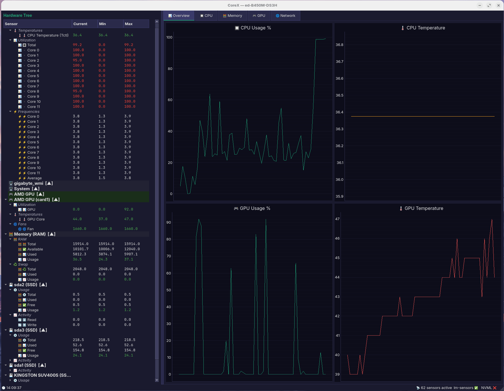
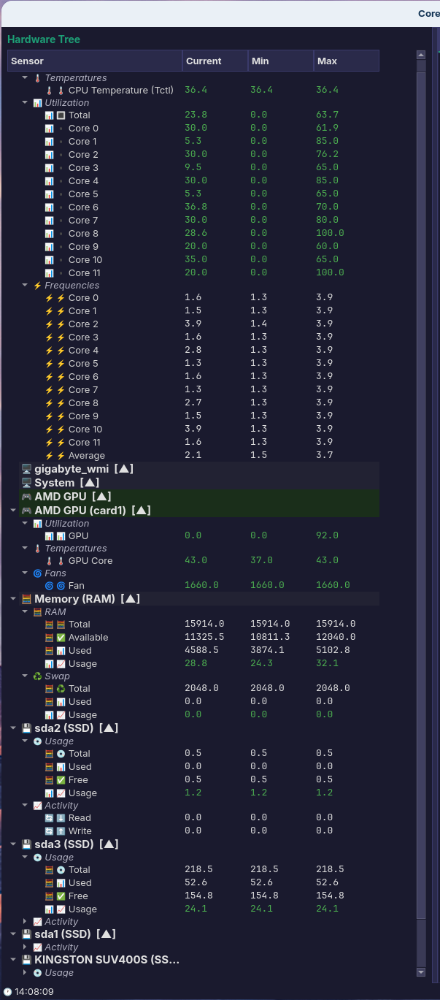
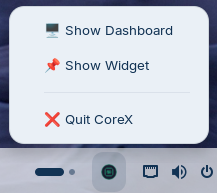

# CoreX — Hardware Monitor for Linux

> "Your machine's core, exposed."

A hardware monitor for Linux with an always-on-top
draggable widget, HWiNFO-style sensor tree with real
sensor names, and live charts for all components.

## Features
- Always-on-top draggable widget with live metrics
- HWiNFO-style sensor tree (CPU, GPU, RAM, Disk, Network)
- Real sensor names — not "temp1", "temp2"
- Live charts for CPU, GPU, Memory, Network, Storage
- AMD and Nvidia GPU support
- Automatic sensor identification wizard
- Dark theme throughout

## Requirements
- Linux with X11 or XWayland
- Python 3.10+
- lm-sensors

## Installation

### Ubuntu / Zorin OS / Linux Mint
  sudo apt install lm-sensors libxcb-cursor0 python3-pip
  sudo sensors-detect --auto

### Fedora / RHEL
  sudo dnf install lm_sensors python3-pip

### Install Python dependencies
  pip3 install PyQt6 pyqtgraph pynvml \
    --break-system-packages

### Clone and run
  git clone https://github.com/Edewin/corex.git
  cd corex
  PYTHONPATH=. python3 corex/main.py

## Screenshots
Coming soon.

## Author
Eduard Soltuzu

## License
MIT
## Screenshots

### Widget over a game

### Dashboard with live charts

### Hardware Tree — HWiNFO style

### System tray

